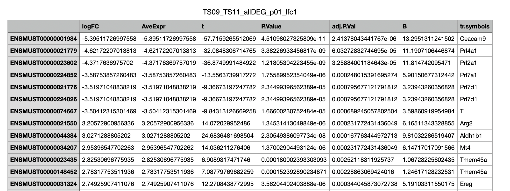

Topic 04: The role of tissue-restricted antigens (TRAs) in the embryonic development
====================================================================================

**Supervisor:**

* Dr. Maria Dinkelacker, Institute of Pharmacy and molecular biology (IPMB) Heidelberg, m.dinkelacker@uni-heidelberg.de (Prof. Dr. Brand Saberi, University Bochum)

**Introduction:**

The role of tissue development in the embryonic development as well as the chemokine signaling in embryonic stem cells is still highly unknown. In the development of central-self tolerance of the immune system, we found about 3770 genes, tissue-restricted antigens (TRAs), which are highly up-regulated in medullary thymic epithelial cells (mTECs) in the thymus in order to negatively select T cells during the development to prevent autoimmunity, the establishment of central-self tolerance (Kyewski et al. 2004).

{width=60%}

*Fig.1*
Example of a tissue-restricted antigen (TRA) - Dinkelacker 2007, Dinkelacker 2019

In the work of Dinkelacker 2007 “establishing a database of tissue-restricted antigens, TRA-DB” and Dinkelacker 2019 “chromosomal clustering of tissue-restricted antigens” we defound and found many TRAs. We determined a gene to be tissue-restricted if it exceeds 5x the median gene expression in at least one and not more than five tissues out of all tissues in the dataset. Tissue, which belong together, such as PNS specific tissues, as well as CNS specific tissues as well as others, we grouped together and regarded as one tissue (Dinkelacker, 2007, Dinkelacker, 2019).

We analyzed six different datasets for TRAs in human and in mouse, gene expression data in microarrays as well as RNAseq data (GTEX dataset) as well a one human protein atlas dataset on the protein level (Dinkelacker, 2007, Dinkelacker, 2019).

During the embryonic development the migration of cells is mostly regulated through the expression of chemokine ligands and receptors, the same is true for the migration of immune cells in human and mice, as well as in the formation of tumors and the surrounding tumor microenvironment. Both the development of mammals, as well as the migration of immune cells in cancer, but also the metastasis of cancer can be predicted upon the chemokine ligand and receptor profile.

Tissue-specificity is most important in the development of the three germ layers, the endoderm, the exoderm as well as the mesoderm, this means, that during gastrulation, as well as neurulation, the gene expression and development of certain tissues ist most important and can be shadowed in gene expression data.

In our project we aim to put together our knowledge of tissue-restricted genes (TRAs) from Dinkelacker, 2007, Dinkelacker 2019 and the knowledge of Dr. Greiner (Höving et al. 2020) as well as Prof. Dr. Brand Saberi upon the gene expression of TRAs in the embryonic development.
We will have different students working on this topic and have a joint project, IPMB Heidelberg and the stem cell unit, University Bochum.

**Literature:** 

* Kyewski et al. 2004, Self-representation in the thymus: an extended view, Nat. Rev. Immunol. 2004 Sep, 4 (9) 699-698. https://pubmed.ncbi.nlm.nih.gov/15343368/

* Dinkelacker 2019. Chromosomal clustering of tissue restricted antigens, Dissertation, University Heidelberg, Germany.

* Dinkelacker 2007. A database of genes that are expressed in a tissue-restricted manner to analyse promiscous gene expression in medullary thymic epithelial cells. Diplomarbeit, Albert-Ludwigs-Universitaet, Freiburg, Germany.

* Saberi et al., different papers, Embryonic development

* Chemokine signaling, different papers (review papers of your choice)

* Book: Wolperts, Embrology, Gastrulation, Embryonic stem cells, neurulation (book of your choice)

* Höving et al. 2020, Transcriptome Analysis Reveals High Similarities between Adult Human Cardiac Stem Cells and Neural Crest-Derived Stem Cells

* Literature on cell migration, gastrulation, embryonic stem cells, neurulation, the role of chemokines in the embryonic development and tissue differentiation

**Literature for the TRA datasets:**

only for citation reasons, dont read!

*  Su et al. 2002, Large-scale analysis of the human and mouse transcriptomes.
Proc Natl Acad Sci U S A. 2002 Apr 2;99(7):4465-70. https://pubmed.ncbi.nlm.nih.gov/11904358/

* Su et al. 2004, A gene atlas of the mouse and human protein-encoding transcriptomes. Proc Natl Acad Sci U S A. 2004 Apr 20;101(16):6062-7. https://pubmed.ncbi.nlm.nih.gov/15075390/

*  Roth et al. 2006, Gene expression analyses reveal molecular relationships among 20 regions of the human CNS. Neurogenetics. 2006 May;7(2):67-80. https://pubmed.ncbi.nlm.nih.gov/16572319/

* Lattin et al. 2008, Expression analysis of G Protein-Coupled Receptors in mouse macrophages. Immunome Res. 2008 Apr 29;4:5. https://pubmed.ncbi.nlm.nih.gov/18442421/

* GTEX 2013, The Genotype-Tissue Expression (GTEx) project.
GTEx Consortium. Nat Genet. 2013 Jun;45(6):580-5. https://pubmed.ncbi.nlm.nih.gov/23715323/

* GTEX 2015, Human genomics. The Genotype-Tissue Expression (GTEx) pilot analysis: multitissue gene regulation in humans.
GTEx Consortium. Science. 2015 May 8;348(6235):648-60. https://pubmed.ncbi.nlm.nih.gov/25954001/

* Uhlén et al. 2015, Proteomics. Tissue-based map of the human proteome.
Science. 2015 Jan 23;347(6220):1260419. https://pubmed.ncbi.nlm.nih.gov/25613900/

**Research task:**

* find a dataset (Microarray data in the GEO database), if possible Affymetrix chips, for any species of your choice. We accept any dataset which gives gene expression data for several time points, for example: (dont pick this one, it is only an example)

- GEO, GSE39897, https://www.ncbi.nlm.nih.gov/geo/query/acc.cgi?acc=GSE39897
#Lu et al. 2012

* get the TRA data for tissue specificity from Dr. Dinkelacker (Dropbox folder)

* get the R course folder from Dr. Dinkelacker (Dropbox folder), install R, Bioconductor and the packages you need for Microarray analysis on your computer.

* download the raw data of your dataset of choice, including the original paper, please tell Dr. Dinkelacker, which one you pick, and analyze the data for gene expression, differential analysis of the genes during the embryonic development (R course)

* analyse the adj. pvalues of 0.01 and 0.05 with a limma analysis and kmeans clustering (R course), heatmaps

* extract all TRAs from this data and annotate the tables for tissue-specificity (tables)

* extract all Chemokines, Receptors from this data (tables)

* Try to find biological explanations for what you find from the literature.

* upload all your tables, the R script and plots for each project in a dropbox folder

* Write a report as told in the course, we will teach you the structure of a report on the 27.4. 10-12 am, online and if you like (optional) and in addition 29.4. 9am-5pm latex course (not mandatory)

* From these tables only use, what you need and might suite your data.

* import these tables into R, you only need the species of choice, if you pick a species for your data, other than human or mouse, please transfer TRAs via the gene symbol, otherwise you can use the Ensemble Transcript ID, try to analyze your data on the basis of the ensembl transcript ID.

* annotate if possible your data with a brainarray package, if this is not possible go via the affy_id and find the correlation in ensemble biomart for annotation.

* ask any question any time, or sign up on fridays to the open programming hour, online at 3pm on demand.

**5 different groups of the project**

group1: embryonic dataset 1 (of your choice), please tell me the author, paper and GSE number

group2: embryonic dataset 1 (of your choice), please tell me the author, paper and GSE number

group3: embryonic dataset 1 (of your choice), please tell me the author, paper and GSE number

group4: embryonic dataset 1 (of your choice), please tell me the author, paper and GSE number

group5: embryonic dataset 1 (of your choice), please tell me the author, paper and GSE number

**Further explanation**

* find the description for the microarray analysis (methods part) in the Phd thesis, Dinkelacker, 2019

* Some example data from the dataset GSE39897 analyzed by Boldemir et al. 2022, see attached, as a guidline, not exclusive, as you can see the time development of chemokine ligands and receptors here, you can also pick a certain tissue-type of your choice and plot the first 25 most differentially expressed genes from this, for example the heart.

* follow your heart for science in reasearch, 1 answered question will bring up 100 new questions, this is science !

**Dataset GSE39897 as an example (mouse embryonic development), Boldemir et al. 2022**

{width=100%}

*Table 1*
Differential gene expression in the mouse between the 9.th and the 11.th week

{width=100%}

*Table 1*
Differential gene expression in the mouse between the first and 9.th week

{width=100%}

*Table 3*
Differential gene expression of chemokines and chemokine receptors between the 9.th and the 11.th week

{width=100%}

*Fig.1*
Chemokine expression over time in the mouse embryonic development

{width=40%}

*Fig.2*
Tissue distribution of differential gene expression in the mouse between the 9.th and the 11.th week.

{width=60%}

*Fig. 3*
Treemap of embryogenesis in the mouse between the first and 9.th week.

As plots you may use, anything you like, including for example ...

- Heatmap of these genes *
- Cluster analysis of your genes *
- PCA*
- k-means*
- hierarchical clustering*
- statistical test (limma analysis, t-test, F-test)*
- Venn diagram*

Please find the R script from Boldemir et al. 2022 in the dropbox folder of the TRAs

